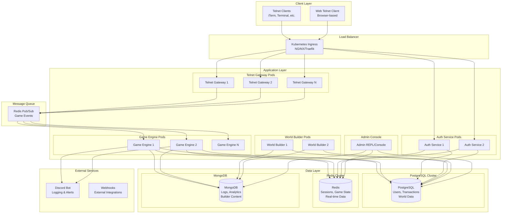
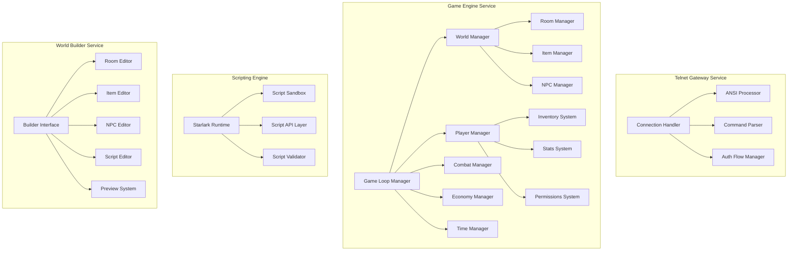
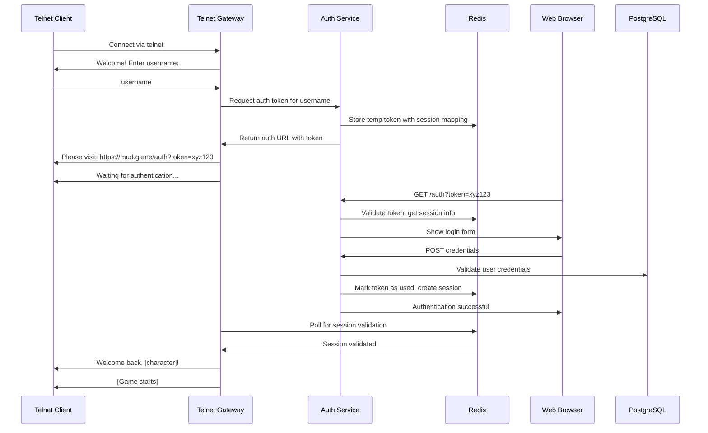
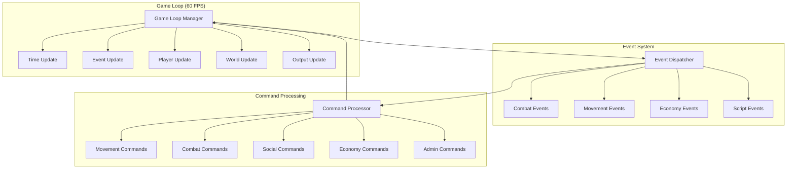
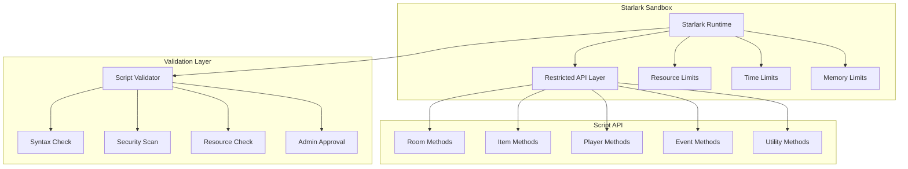
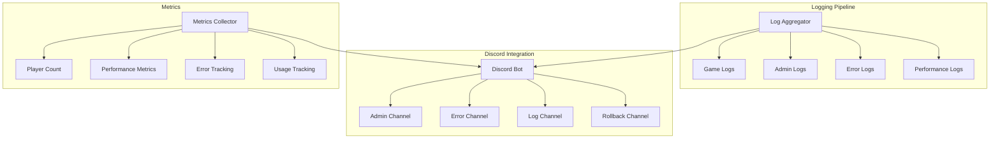

# Race Condition Kingdom - MUD Architecture Plan

## 🎯 Project Overview

Race Condition Kingdom is a modern MUD (Multi-User Dungeon) written in Go, built around nostalgia for telnet-based gameplay but modernized with out-of-band HTTPS authentication, extensibility, and balance-focused gameplay design.

## 🏗️ High-Level System Architecture



## 🔧 Core Service Architecture



## 🗄️ Database Schema Design

### PostgreSQL Schema (Critical Data)

```sql
-- Users and Authentication
CREATE TABLE users (
    id UUID PRIMARY KEY DEFAULT gen_random_uuid(),
    username VARCHAR(50) UNIQUE NOT NULL,
    email VARCHAR(255) UNIQUE NOT NULL,
    password_hash VARCHAR(255) NOT NULL,
    created_at TIMESTAMP DEFAULT NOW(),
    last_login TIMESTAMP,
    is_active BOOLEAN DEFAULT true,
    permissions JSONB DEFAULT '{}'
);

-- Characters
CREATE TABLE characters (
    id UUID PRIMARY KEY DEFAULT gen_random_uuid(),
    user_id UUID REFERENCES users(id) ON DELETE CASCADE,
    name VARCHAR(50) UNIQUE NOT NULL,
    level INTEGER DEFAULT 1,
    experience BIGINT DEFAULT 0,
    health INTEGER DEFAULT 100,
    max_health INTEGER DEFAULT 100,
    stamina INTEGER DEFAULT 100,
    max_stamina INTEGER DEFAULT 100,
    gold BIGINT DEFAULT 0,
    alignment_lawful INTEGER DEFAULT 0, -- -100 to 100
    alignment_good INTEGER DEFAULT 0,   -- -100 to 100
    current_room_id UUID,
    last_rest TIMESTAMP DEFAULT NOW(),
    is_sleeping BOOLEAN DEFAULT false,
    created_at TIMESTAMP DEFAULT NOW()
);

-- World Structure
CREATE TABLE rooms (
    id UUID PRIMARY KEY DEFAULT gen_random_uuid(),
    name VARCHAR(100) NOT NULL,
    description TEXT,
    short_description VARCHAR(255),
    room_type VARCHAR(50) DEFAULT 'normal', -- safe, pvp, shop, etc.
    exits JSONB DEFAULT '{}', -- {"north": "room_id", "south": "room_id"}
    flags JSONB DEFAULT '{}', -- room properties
    script_id UUID,
    created_by UUID REFERENCES users(id),
    approved_by UUID REFERENCES users(id),
    created_at TIMESTAMP DEFAULT NOW(),
    approved_at TIMESTAMP
);

-- Items and Economy
CREATE TABLE items (
    id UUID PRIMARY KEY DEFAULT gen_random_uuid(),
    name VARCHAR(100) NOT NULL,
    description TEXT,
    item_type VARCHAR(50) NOT NULL, -- weapon, armor, consumable, etc.
    weight DECIMAL(10,2) DEFAULT 0,
    value BIGINT DEFAULT 0,
    properties JSONB DEFAULT '{}',
    alignment_required JSONB DEFAULT '{}',
    script_id UUID,
    created_by UUID REFERENCES users(id),
    approved_by UUID REFERENCES users(id),
    created_at TIMESTAMP DEFAULT NOW()
);

-- Player Inventory
CREATE TABLE inventory (
    id UUID PRIMARY KEY DEFAULT gen_random_uuid(),
    character_id UUID REFERENCES characters(id) ON DELETE CASCADE,
    item_id UUID REFERENCES items(id),
    quantity INTEGER DEFAULT 1,
    equipped BOOLEAN DEFAULT false,
    acquired_at TIMESTAMP DEFAULT NOW()
);

-- Transactions (Economy)
CREATE TABLE transactions (
    id UUID PRIMARY KEY DEFAULT gen_random_uuid(),
    from_character_id UUID REFERENCES characters(id),
    to_character_id UUID REFERENCES characters(id),
    item_id UUID REFERENCES items(id),
    gold_amount BIGINT DEFAULT 0,
    transaction_type VARCHAR(50) NOT NULL, -- sale, gift, auction, etc.
    created_at TIMESTAMP DEFAULT NOW()
);

-- Auction House
CREATE TABLE auctions (
    id UUID PRIMARY KEY DEFAULT gen_random_uuid(),
    seller_id UUID REFERENCES characters(id),
    item_id UUID REFERENCES items(id),
    starting_bid BIGINT NOT NULL,
    current_bid BIGINT,
    current_bidder_id UUID REFERENCES characters(id),
    ends_at TIMESTAMP NOT NULL,
    status VARCHAR(20) DEFAULT 'active', -- active, completed, cancelled
    created_at TIMESTAMP DEFAULT NOW()
);
```

### Redis Data Structures (Real-time Data)

```
# Session Management
session:{session_id} -> {
    "character_id": "uuid",
    "user_id": "uuid", 
    "connection_id": "string",
    "last_activity": timestamp,
    "current_room": "uuid",
    "auth_token": "string"
}

# Authentication Tokens
auth_token:{token} -> {
    "session_id": "string",
    "expires_at": timestamp,
    "used": boolean
}

# Game State
room:{room_id}:players -> Set of character_ids
character:{character_id}:location -> room_id
character:{character_id}:online -> boolean

# Real-time Events
game_events -> Pub/Sub channel for game events
room:{room_id}:events -> Pub/Sub channel for room-specific events

# World Builder Sessions
builder:{user_id}:session -> {
    "mode": "building",
    "sandbox_world": "world_id",
    "active_since": timestamp
}
```

## 🔐 Authentication Flow



## 🎮 Game Loop Architecture



## 🛡️ Security & Sandboxing



## 📊 Monitoring & Logging



## 🔧 Key Go Packages & Structure

```
race-condition-kingdom/
├── cmd/
│   ├── telnet-gateway/     # Telnet server entry point
│   ├── game-engine/        # Game logic service
│   ├── auth-service/       # Authentication service
│   ├── world-builder/      # World building service
│   └── admin-console/      # Admin REPL
├── internal/
│   ├── auth/              # Authentication logic
│   ├── game/              # Core game systems
│   │   ├── world/         # World management
│   │   ├── player/        # Player management
│   │   ├── combat/        # Combat system
│   │   ├── economy/       # Economy system
│   │   └── time/          # Time/season system
│   ├── telnet/            # Telnet protocol handling
│   ├── ansi/              # ANSI escape code utilities
│   ├── scripting/         # Starlark integration
│   ├── database/          # Database abstractions
│   ├── events/            # Event system
│   └── discord/           # Discord bot integration
├── pkg/
│   ├── models/            # Shared data models
│   ├── config/            # Configuration management
│   └── utils/             # Shared utilities
├── scripts/               # Deployment scripts
├── k8s/                   # Kubernetes manifests
└── docs/                  # Documentation
```

## 🚀 Deployment Strategy

The system will be deployed on Kubernetes with:

- **Horizontal Pod Autoscaling** for game engine and telnet gateway pods
- **StatefulSets** for database clusters
- **ConfigMaps** and **Secrets** for configuration management
- **Persistent Volumes** for database storage
- **Service Mesh** (Istio) for inter-service communication
- **Monitoring** with Prometheus and Grafana

## 🎯 Implementation Phases

1. **Phase 1**: Core infrastructure (auth, telnet gateway, basic game loop)
2. **Phase 2**: World system and basic gameplay (movement, rooms, items)
3. **Phase 3**: Combat and economy systems
4. **Phase 4**: Starlark scripting and world builder
5. **Phase 5**: Advanced features (PvP, auctions, time cycles)
6. **Phase 6**: Polish and optimization

## 🎮 Core Gameplay Features

### 🔐 Authentication & Connectivity
- Players connect over telnet (ANSI-supported clients like iTerm, Apple Terminal, etc.)
- After entering a username, they are provided a one-time HTTPS link to authenticate
- The MUD pauses until the authentication is confirmed via API or queue system
- A web-based telnet client (no GUI) will also be available
- Session management and authentication should be secure, user-friendly, and session-limited

### 🧱 Architecture Requirements
- The backend is intended to run in Kubernetes with stateless containers
- All data (users, rooms, items, inventory, scripting, etc.) will be stored in a hybrid database approach
- Each container must have independent access to the shared database
- Changes to in-game data or scripts will be logged to Discord via a bot for transparency and moderation, including rollback capability

### 🎮 Core Gameplay Systems
- The world begins with a town square hub, with access to:
  - Banks (two, with different rules/benefits)
  - Shops (magic, weapons, armor, trinkets)
  - Inns (player rest, guild inventory access)
  - Auction House (player-to-player sales)
- PvP is territory-specific; town square is always a safe zone
- Players lose stamina/HP if they don't rest at intervals
- Disconnecting marks the player as "asleep" and immune from harm in PvP zones
- Time-of-day and seasonal cycles affect gameplay and encounters

### ⚔️ Death, Recovery, & Balance
- Player death does not delete characters:
  - They are teleported to the town square infirmary
  - Recovery could require in-game currency or a wait period
  - Recovery may joke about the American healthcare system (e.g., "bill required to leave")
- Magic and combat systems include balancing tradeoffs:
  - Powerful weapons exact a toll on the user (HP, stamina, etc.)
  - Items are classified by alignment (Lawful/Chaotic, Good/Evil)
  - Overpowered items or suspicious player behavior should trigger admin alerts

### 🧠 Extensibility
- Select users can enter World Building Mode, isolated from the live game
- This mode enables:
  - Creating new rooms, NPCs, items, dungeons
  - Full scripting of logic (AI, combat, effects, triggers)
  - Scripts will use Starlark for secure sandboxing
- Builders are sandboxed, and new content is locked until admin-approved
- Permissions determine whether custom items can be moved between "territories"
- Builders cannot affect the live world while building

### 💰 Economy
- Player economy supports:
  - Item gifting, sales, and auctions
  - A player auction house for open bidding
- All items have weight; players have an encumbrance limit
- Players can rent rooms at the inn for "infinite" storage — a humorous nod to Hitchhiker's Guide

## 🏆 Architecture Benefits

This architecture provides:
- ✅ Stateless, horizontally scalable services
- ✅ Secure authentication with Redis-backed tokens
- ✅ Hybrid database approach for optimal performance
- ✅ Sandboxed Starlark scripting for world building
- ✅ Real-time event system for multiplayer interactions
- ✅ Discord integration for admin oversight
- ✅ Kubernetes-native deployment
- ✅ Comprehensive monitoring and logging
- ✅ Extensible plugin system for world building
- ✅ Balance-focused gameplay design